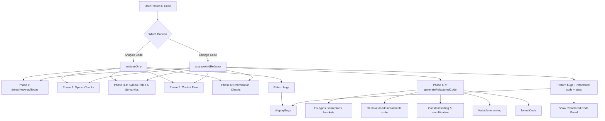

# Analyzer.js — Complete Function Documentation

> **Intelligent Static Code Analyzer for C**
> This file implements a 7-phase compiler-style analysis pipeline: Lexical Analysis → Syntax Analysis → Symbol Table → Semantic Analysis → Control Flow → Optimization → Code Generation.

---

# 🔬 Quick Reference — Algorithms Used & Alternate Approaches

> **Read this section first** to understand every algorithm/technique the analyzer relies on, and what alternatives exist in compiler theory & static analysis.

---

## Phase 1 — Lexical Analysis (Fuzzy Matching)

| # | Algorithm Used | Purpose | How It Works |
|---|---|---|---|
| 1 | **Damerau-Levenshtein Distance** (Dynamic Programming) | Detects keyword typos like `itn` → `int` | Builds a `(m+1)×(n+1)` DP matrix computing min edits (insert, delete, substitute, **transpose**). Transposition of adjacent chars costs 1 edit instead of 2. |
| 2 | **Fuzzy Token Matching with Adaptive Thresholds** | Avoids false positives on short vs long keywords | Short keywords (≤3 chars): max 1 edit. Longer keywords: max 2 edits. Length difference filter of ±2 chars. |

### Alternate Algorithms / Theorems

| Alternate | Description | Trade-off |
|---|---|---|
| **Standard Levenshtein Distance** | Same as Damerau-Levenshtein but without transposition support | Simpler to implement but misses common keyboard typos like `itn`→`int` (counts as 2 edits instead of 1) |
| **Optimal String Alignment (OSA)** | A restricted version of Damerau-Levenshtein that doesn't allow substring edits after transposition | Slightly faster, but less accurate for chained edits |
| **Jaro-Winkler Similarity** | Measures character-level similarity with bonus weight for matching prefixes | Better for name matching; less suited for short C keywords |
| **Bitap (Shift-Or) Algorithm** | Bit-parallel approximate string matching | Very fast for fixed max edit distance; used by `agrep`. Good for large keyword sets |
| **BK-Tree (Burkhard-Keller Tree)** | Metric tree that indexes strings by edit distance | O(log n) lookup instead of O(n) linear scan. Ideal when keyword set is very large |
| **Trie with Error Tolerance** | Traverse a trie allowing up to k mismatches per branch | Efficient for dictionary-based spell checking (e.g., Norvig's spell corrector) |
| **Soundex / Metaphone** | Phonetic algorithms that encode similar-sounding words identically | Useful for spoken-language typos but not ideal for code identifiers |
| **N-gram Similarity** | Compares overlapping character n-grams between strings | Fast approximate matching; used in plagiarism detection. Less precise for short tokens |

---

## Phase 2 — Syntax Analysis

| # | Algorithm Used | Purpose | How It Works |
|---|---|---|---|
| 3 | **Stack-Based Bracket Matching** | Detects mismatched `[]`, `()`, `{}` | Pushes opening delimiters onto a stack; pops on closing delimiters. Unmatched items at the end → errors. |
| 4 | **Regex Pattern Matching** | Detects missing semicolons, malformed control structures | Applies sets of regex patterns to each line. Exception patterns prevent false positives. |
| 5 | **String Literal Tracking** (State Machine) | Ignores delimiters inside strings/chars | Toggles `inString`/`inChar` flags on `"` and `'` characters, skipping analysis inside literals. |

### Alternate Algorithms / Theorems

| Alternate | Description | Trade-off |
|---|---|---|
| **Recursive Descent Parser** | Hand-written top-down parser following C grammar productions | Far more accurate; can parse full C syntax. Much more complex to implement. |
| **LR/LALR Parser (e.g., Yacc/Bison)** | Bottom-up parser using grammar tables | Industry standard for compilers; handles full C grammar. Requires grammar specification. |
| **PEG (Parsing Expression Grammar)** | Unambiguous recursive parser with ordered choice | Simpler than LR; handles C-like syntax well. Used by tree-sitter. |
| **Earley Parser** | General context-free parser handling any CFG, including ambiguous ones | O(n³) worst case but handles all grammars; useful for error recovery. |
| **LL(k) Parser** | Top-down parser with k tokens of lookahead | Simpler than LR but can't handle left-recursive grammars directly. |
| **Shunting-Yard Algorithm** (Dijkstra) | Converts infix expressions to postfix using operator precedence | Relevant for expression parsing in conditions and assignments. |
| **Abstract Syntax Tree (AST)** | Full tree representation of parsed code instead of line-by-line regex | Industry standard; enables much deeper analysis. Tools: Clang AST, tree-sitter. |

---

## Phase 3 — Symbol Table Management

| # | Algorithm Used | Purpose | How It Works |
|---|---|---|---|
| 6 | **Hash Map-Based Symbol Table** (`Map`) | Tracks variables, arrays, functions | Stores declarations with metadata (type, line, initialization status) for O(1) lookup. |
| 7 | **Two-Pass Function Detection** | Separates definitions from calls | Pass 1: regex-based function definition scan. Pass 2: function call scan (excluding definition lines). |
| 8 | **Set-Based Call Tracking** (`Set`) | Records all function calls for cross-referencing | O(1) membership check when comparing defined vs. called functions. |

### Alternate Algorithms / Theorems

| Alternate | Description | Trade-off |
|---|---|---|
| **Scoped/Nested Symbol Table** (Tree of Hash Maps) | Each `{}` block creates a child scope | Handles variable shadowing and block scoping correctly. More complex. |
| **Symbol Table with Type Lattice** | Tracks type relationships (subtype hierarchy) | Enables type inference and implicit conversion detection. |
| **SSA (Static Single Assignment) Form** | Each variable assigned exactly once; uses φ-functions at join points | Industry standard for optimizing compilers (LLVM, GCC). Enables powerful optimizations. |
| **Use-Def / Def-Use Chains** | Explicitly links each use of a variable to its definition(s) and vice versa | Precise tracking of data flow; better uninitialized variable detection. |
| **Trie-Based Symbol Table** | Stores identifiers in a trie for prefix-based lookup | Efficient for auto-completion; less common for analysis. |

---

## Phase 4 — Semantic Analysis

| # | Algorithm Used | Purpose | How It Works |
|---|---|---|---|
| 9 | **Regex-Based Assignment-in-Condition Detection** | Catches `=` instead of `==` in conditions | Extracts condition content from `if`/`while`/`for`, then checks for single `=` not preceded by comparison operators. |
| 10 | **Three-Pass Variable Analysis** | Detects uninitialized usage, unused variables | Pass 1: declaration scan. Pass 2: usage-before-assignment check. Pass 3: occurrence counting. |
| 11 | **Format Specifier Parsing** | Detects printf/scanf argument mismatches | Counts `%d`, `%f`, `%s` etc. in format strings, compares against argument count. Skips `%%`. |
| 12 | **Array Bounds Analysis** (Constant + Loop-Based) | Detects out-of-bounds access | Tracks declared array sizes; checks constant indices and for-loop bound variables against sizes. |
| 13 | **Brace Counting for Function Body Tracing** | Detects missing return in non-void functions | Increments/decrements brace counter to identify function body boundaries, then checks for `return`. |
| 14 | **Backreference Regex** | Detects self-assignment (`x = x;`) | Uses regex `(\w+)\s*=\s*\1\s*;` where `\1` is a backreference to the captured variable name. |

### Alternate Algorithms / Theorems

| Alternate | Description | Trade-off |
|---|---|---|
| **Type Inference (Hindley-Milner)** | Automatically deduces types without explicit annotations | More powerful than regex-based type tracking; used in functional languages. |
| **Abstract Interpretation** | Executes program on abstract domains (intervals, signs, etc.) | Can prove absence of runtime errors. Theoretical foundation: Cousot & Cousot (1977). |
| **Data Flow Analysis (Reaching Definitions)** | For each point in code, computes which definitions may reach it | More precise than line-by-line scanning for uninitialized variable detection. |
| **Symbolic Execution** | Treats variables as symbols, explores all execution paths | Can discover deep bugs like buffer overflows across function calls. |
| **Taint Analysis** | Tracks flow of untrusted data through the program | Detects security vulnerabilities (SQL injection, buffer overflow). |
| **Constraint-Based Analysis** | Generates and solves constraints over program variables | Can verify array bounds statically; used in tools like CBMC. |
| **SMT Solvers (Z3, CVC5)** | Satisfiability Modulo Theories — proves/disproves logical formulas about code | Used by advanced static analyzers (e.g., Facebook Infer, KLEE) for precise bug detection. |

---

## Phase 5 — Control Flow Analysis

| # | Algorithm Used | Purpose | How It Works |
|---|---|---|---|
| 15 | **Linear Scan with State Flag** | Detects unreachable code after `return` | Sets an "after return" flag; flags subsequent non-empty lines until `}` resets the flag. |
| 16 | **Pattern-Based Infinite Loop Detection** | Catches `while(1)`, `for(;;)`, contradictory loops | Regex-matches loop constructs, analyzes conditions, checks loop body for `break`/`return`. |
| 17 | **Loop Body Variable Modification Analysis** | Detects loops where condition variable never changes | Scans loop body for assignments to the condition variable. No modification → infinite loop. |
| 18 | **Empty Body Detection** (Single-line & Multi-line) | Catches `if(x) ;`, `while(x) {}` etc. | Pattern matches semicolons after control keywords and `{` immediately followed by `}`. |

### Alternate Algorithms / Theorems

| Alternate | Description | Trade-off |
|---|---|---|
| **Control Flow Graph (CFG)** | Represents program as a directed graph of basic blocks | Industry standard; enables dominance analysis, loop detection, reachability. Much more precise. |
| **Dominator Tree (Lengauer-Tarjan)** | Computes dominance relationships in CFG | Can identify unreachable code, natural loops, and back edges precisely. |
| **Strongly Connected Components (Tarjan/Kosaraju)** | Finds SCCs in CFG to detect all loops | Catches complex loop structures (mutual recursion, nested loops). |
| **Interval Analysis** | Partitions CFG into nested intervals for structured analysis | Used in decompilers and advanced optimizers. |
| **Termination Analysis (Ranking Functions)** | Proves whether a loop terminates using mathematical ranking functions | Can prove termination for complex loops; undecidable in general (Halting Problem). |
| **Halting Problem** (Turing, 1936) | It is impossible to decide in general whether a program halts | Infinite loop detection is undecidable; any static analyzer has inherent limitations. |
| **Rice's Theorem** | Any non-trivial semantic property of programs is undecidable | Theoretical limitation: no static analyzer can detect all bugs without false positives/negatives. |

---

## Phase 6 — Optimization Detection

| # | Algorithm Used | Purpose | How It Works |
|---|---|---|---|
| 19 | **Algebraic Identity Detection** (Pattern Matching) | Flags `x+0`, `x*1`, `x*0` etc. | Regex patterns match known algebraic identity operations that have no effect or known results. |
| 20 | **Constant Expression Detection** | Flags `if(1)`, `if(0)`, `while(0)` etc. | Pattern matches literal constants in condition positions. |
| 21 | **Division by Zero Detection** | Flags `/ 0` patterns | Regex detects division by literal zero (not followed by another digit). |

### Alternate Algorithms / Theorems

| Alternate | Description | Trade-off |
|---|---|---|
| **Constant Folding / Propagation** | Evaluates constant expressions at compile time and propagates known values | More thorough than pattern matching; used in all production compilers. |
| **Common Subexpression Elimination (CSE)** | Identifies and reuses repeated computations | Reduces redundant calculations; requires expression DAG or value numbering. |
| **Dead Code Elimination (DCE)** | Removes code that doesn't affect program output | Uses liveness analysis on CFG; more precise than pattern matching. |
| **Strength Reduction** | Replaces expensive operations with cheaper ones (e.g., `x*2` → `x<<1`) | Classic optimization in loop bodies. |
| **Loop-Invariant Code Motion (LICM)** | Moves computations that don't change inside a loop to before the loop | Reduces per-iteration work; requires reaching definition analysis. |
| **Peephole Optimization** | Small window of instructions replaced with faster equivalents | What the current analyzer partially implements; could be extended. |
| **GVN (Global Value Numbering)** | Assigns numbers to values to detect equivalences across basic blocks | More powerful than CSE; used in LLVM's optimization pipeline. |
| **Partial Redundancy Elimination (PRE)** | Combines CSE and LICM into a unified framework | Eliminates both fully and partially redundant computations. |

---

## Phase 7 — Code Generation & Fixing

| # | Algorithm Used | Purpose | How It Works |
|---|---|---|---|
| 22 | **Multi-Pass Line-by-Line Transformation** | Applies all fixes to produce refactored code | Pass 1: line fixes (typos, semicolons, etc.). Pass 2: unreachable code removal. Pass 2.5: brace balancing. Pass 3: formatting. |
| 23 | **Constant Folding via `eval()`** | Computes `3+5` → `8` at analysis time | Evaluates pure arithmetic sub-expressions in assignments. |
| 24 | **Algebraic Simplification** | Simplifies `x+0` → `x`, `x*1` → `x` | Regex-based pattern replacement of identity operations. |
| 25 | **Type-Based Variable Renaming** | Renames short vars (`x`, `i`) to descriptive names | Uses predefined name pools per type (`int` → counter/number/value, etc.). |
| 26 | **Indentation-Based Code Formatter** | Reformats code with proper indentation | Tracks brace depth; applies 4-space indentation per level. Normalizes operator spacing. |
| 27 | **Brace Balancing** (Count & Append) | Fixes missing closing `}` | Counts all `{` and `}` (excluding strings/comments); appends missing `}` at end. |

### Alternate Algorithms / Theorems

| Alternate | Description | Trade-off |
|---|---|---|
| **AST-Based Code Generation** | Transform AST back into source code (pretty-printing) | Preserves code semantics perfectly; industry standard (Clang-format, Prettier). |
| **Source-to-Source Transformation (Transpilation)** | Rewrite code using AST pattern matching rules | More precise than regex line transforms; used by Coccinelle, Clang-Tidy. |
| **Template-Based Code Generation** | Uses code templates with placeholder substitution | Cleaner for large-scale generation; used in code generators and IDEs. |
| **SSA-Based Optimization + Emission** | Optimize on SSA form, then emit code | Production compiler approach (LLVM IR → Machine Code). Maximum optimization power. |
| **Automated Program Repair (GenProg)** | Uses genetic programming to evolve bug fixes | Can fix bugs automatically without predefined patterns; research-stage. |
| **Syntax-Guided Synthesis (SyGuS)** | Synthesizes code from specifications | Can generate correct fixes from examples/specs; uses SMT solvers. |

---

## Summary — All 27 Techniques at a Glance

| Phase | Techniques Used |
|---|---|
| **1. Lexical** | Damerau-Levenshtein Distance, Fuzzy Matching with Adaptive Thresholds |
| **2. Syntax** | Stack-Based Delimiter Matching, Regex Pattern Matching, String Literal State Tracking |
| **3. Symbol Table** | Hash Map Symbol Table, Two-Pass Function Detection, Set-Based Call Tracking |
| **4. Semantic** | Regex Assignment Detection, Three-Pass Variable Analysis, Format Specifier Parsing, Array Bounds Analysis, Brace-Count Body Tracing, Backreference Regex |
| **5. Control Flow** | Linear Scan State Flag, Pattern-Based Loop Detection, Loop Body Modification Analysis, Empty Body Detection |
| **6. Optimization** | Algebraic Identity Detection, Constant Expression Detection, Division by Zero Detection |
| **7. Code Generation** | Multi-Pass Transformation, Constant Folding (`eval`), Algebraic Simplification, Type-Based Renaming, Indentation Formatter, Brace Balancing |

---

> **Key Theoretical Limitations:**
> - **Halting Problem** (Turing, 1936): Infinite loop detection is undecidable in the general case.
> - **Rice's Theorem**: Any non-trivial semantic property is undecidable — static analyzers always have false positives/negatives.
> - **Undecidable Pointer Analysis**: Alias analysis for C pointers is undecidable in general, which limits precision of variable tracking.
> - This analyzer takes a **pragmatic regex & pattern-matching approach** that trades theoretical completeness for simplicity and speed.

---


## Architecture Overview

```
┌──────────────────────────────────────────────────────────────┐
│                      CAnalyzer Class                         │
├──────────────┬───────────────┬───────────────────────────────┤
│  Detection   │  Fixing       │  UI Functions (standalone)    │
│  (Phases 1-6)│  (Phase 7)    │                               │
├──────────────┼───────────────┼───────────────────────────────┤
│ detectKey..  │ fixKeyword..  │ analyzeCode()                 │
│ detectMis..  │ fixMissing..  │ changeCode()                  │
│ detectFun..  │ fixInvalid..  │ displayBugs()                 │
│ detectVar..  │ fixArrayOu..  │ updateLineNumbers()           │
│ detectInf..  │ fixPrintf..   │ syncScroll()                  │
│ ...          │ formatCode()  │                               │
└──────────────┴───────────────┴───────────────────────────────┘
```

The analyzer has **two modes**:
- **Analyze Only** (`analyzeOnly`) — detects bugs and reports them
- **Analyze & Refactor** (`analyzeAndRefactor`) — detects bugs AND generates corrected code

---

## Core Methods

### `constructor()`
**Lines 15–48**

Initializes all internal state:
| Property | Type | Purpose |
|---|---|---|
| `bugs` | Array | Collected bug reports |
| `variables` | Map | Symbol table for variables (name → type, line) |
| `arrays` | Map | Array declarations (name → type, size, line) |
| `functions` | Map | Function definitions (name → return type, params, line) |
| `functionCalls` | Set | All function call names found in code |
| `keywordTypoFixes` | Map | Typo → correction mappings from fuzzy matching |
| `stats` | Object | Optimization counters (constants folded, dead code removed, etc.) |
| `variableRenameMap` | Map | Old name → new name for variable renaming |

---

### `analyzeOnly(code)`
**Lines 50–99 | Entry point for "Analyze Code" button**

Runs all detection phases **without** generating refactored code. Calls detection methods in order:
1. Fuzzy keyword matching (typo detection)
2. Syntax checks (semicolons, brackets, parentheses, braces, control structures)
3. Function detection & error checking
4. Variable issue detection
5. Control flow analysis (unreachable code, infinite loops, empty bodies)
6. Optimization checks (redundant expressions, division by zero, constant conditions)

Returns `{ bugs: [...] }` sorted by line number.

---

### `analyzeAndRefactor(code)`
**Lines 101–156 | Entry point for "Change Code" button**

Same detection as `analyzeOnly`, plus calls `generateRefactoredCode()` to produce fixed code.

Returns `{ bugs: [...], refactoredCode: "...", stats: {...} }`.

---

### `addBug(type, severity, line, message, suggestion, explanation)`
**Lines 158–164**

Adds a bug to the collection. **Deduplicates** by checking if a bug with the same type, line, and message already exists. Each bug has:
- `type` — Category (e.g., `MissingSemicolon`, `KeywordTypo`)
- `severity` — `critical` | `error` | `warning` | `info`
- `line` — Line number (1-indexed)
- `message`, `suggestion`, `explanation` — Human-readable descriptions

---

## Phase 1: Fuzzy Matching Engine (Damerau-Levenshtein Distance)

### `damerauLevenshteinDistance(str1, str2)`
**Lines 172–208**

**Algorithm:** Computes the [Damerau-Levenshtein edit distance](https://en.wikipedia.org/wiki/Damerau%E2%80%93Levenshtein_distance) between two strings using dynamic programming.

**How it works:**
1. Creates a `(m+1) × (n+1)` matrix where `m` and `n` are string lengths
2. Base case: transforming an empty string requires `i` insertions
3. For each cell `dp[i][j]`, takes the minimum of:
   - `dp[i-1][j] + 1` — **Deletion** (remove a char from str1)
   - `dp[i][j-1] + 1` — **Insertion** (add a char to str1)
   - `dp[i-1][j-1] + cost` — **Substitution** (replace if chars differ, free if same)
   - `dp[i-2][j-2] + 1` — **Transposition** (swap two adjacent chars, if they match cross-wise)

**Key advantage over standard Levenshtein:** Transpositions like `itn` → `int` count as **1 edit** instead of 2, making it much better for catching common keyboard typos.

**Example:** `damerauLevenshteinDistance("itn", "int")` → `1` (one transposition)

---

### `fuzzyMatchKeyword(token)`
**Lines 203–250**

Compares a token against a list of **50+ C keywords** (types, control flow, standard functions). Returns the closest match or `null`.

**Thresholds to avoid false positives:**
- Keywords ≤ 3 chars (e.g., `int`, `for`): max **1 edit** allowed
- Keywords > 3 chars (e.g., `float`, `return`): max **2 edits** allowed
- Only compares tokens within ±2 characters of keyword length

**Keyword categories covered:**
- **Types:** `int`, `float`, `char`, `double`, `void`, `long`, `short`, `unsigned`, `signed`, `const`, `static`, `extern`, `struct`, `enum`, `typedef`, `union`, `volatile`, `register`, `auto`
- **Control flow:** `if`, `else`, `while`, `for`, `do`, `switch`, `case`, `break`, `continue`, `return`, `goto`, `default`
- **Other:** `sizeof`, `include`, `define`, `main`, `printf`, `scanf`, `malloc`, `free`, `NULL`

---

### `detectKeywordTypos()`
**Lines 252–309**

Scans every line for tokens that might be misspelled C keywords:
1. Skips comments, preprocessor directives, and string literals
2. Extracts all identifier tokens using regex `\b[a-zA-Z_][a-zA-Z0-9_]*\b`
3. Ignores known variables, function names, standard functions, and a list of ~60 common variable names (`temp`, `count`, `result`, etc.)
4. Runs `fuzzyMatchKeyword()` on each remaining token
5. Reports matches as `KeywordTypo` errors with the Levenshtein distance

---

### `fixKeywordTypos(line)`
**Lines 311–327**

During refactoring, replaces all detected typos with their corrections using word-boundary regex replacement.

---

## Phase 2: Syntax Analysis

### `detectMissingSemicolons()`
**Lines 329–401**

**How:** Uses regex patterns to identify lines that should end with `;` but don't:
- Variable declarations (`int x = 5`)
- Assignments (`x = 10`)
- Function calls (`printf("hello")`)
- Return/break/continue statements
- Increment/decrement (`x++`, `--y`)

**Exceptions:** Comments, preprocessor directives, empty lines, opening/closing braces, control structures, function definitions.

---

### `detectMismatchedBrackets()`
**Lines 403–442**

**How:** Uses a **stack-based** approach:
- Push onto stack when `[` is found
- Pop from stack when `]` is found
- If stack is empty on `]` → unmatched closing bracket
- If stack has items at end → unclosed opening brackets

---

### `detectMismatchedParentheses()`
**Lines 444–493**

Same stack-based approach as brackets, but for `(` and `)`. Also **tracks string/char literals** to avoid counting parentheses inside strings.

---

### `detectMismatchedBraces()`
**Lines 495–540**

Same stack-based approach for `{` and `}`. Tracks string literals.

---

### `detectMalformedControlStructures()`
**Lines 542–601**

Detects structural syntax errors:
- `}` used instead of `)` in conditions (e.g., `(x > 0}`)
- `{` found inside condition parentheses
- `while`/`if` without opening `(`
- `for` loops with wrong number of semicolons (must have exactly 2)
- `switch` without parentheses

---

## Phase 3 & 4: Symbol Table & Semantic Analysis

### `detectFunctions()`
**Lines 603–644**

**Pass 1:** Finds function **definitions** using regex:
```
\b(int|float|char|double|void|long|short)\s+(\w+)\s*\(([^)]*)\)\s*\{?
```
Stores each function's name, return type, parameters, and whether it has a body.

**Pass 2:** Finds function **calls** (identifiers followed by `(`) while skipping function definition lines. Stores in `functionCalls` set.

---

### `detectFunctionErrors()`
**Lines 646–711**

Two checks:
1. **Undefined functions** — Called but never defined (and not a standard library function)
2. **Parameter syntax** — Validates that each parameter has both a type and name (e.g., `int x` not just `x`)

---

### `isStandardFunction(name)`
**Lines 713–721**

Returns `true` if the function name is in the standard C library list (36 functions including `printf`, `scanf`, `malloc`, `strlen`, `sqrt`, etc.).

---

### `detectMissingReturn()`
**Lines 723–763**

For non-void functions (except `main`):
1. Traces the function body using brace counting
2. Checks if any `return` statement exists within the body
3. Reports warning if no return found

---

### `detectUnusedFunctions()`
**Lines 765–795**

Compares `functions` (defined) against `functionCalls` (called). Any defined function not in calls (except `main`) is flagged as unused.

---

### `detectAssignmentInCondition()`
**Lines 797–825**

Detects `=` (assignment) used instead of `==` (comparison) inside `if`, `while`, and `for` conditions. Uses regex to extract condition content, then checks for single `=` not preceded by `!`, `<`, `>`, or `=`.

---

### `detectVariableIssues()`
**Lines 827–925**

Three-pass analysis:
1. **Declaration scan** — Finds all variable declarations, records type and initialization status
2. **Uninitialized usage** — For each uninitialized variable, scans lines after declaration to see if it's used before being assigned
3. **Unused detection** — Counts occurrences of each variable (stripping comments); if ≤ 1 occurrence, it's unused

---

### `detectPrintfScanfErrors()`
**Lines 1287–1405**

Five checks:
1. **printf without format string** — `printf(x)` instead of `printf("%d", x)`. Auto-determines the correct format specifier from the variable's type
2. **printf format-argument mismatch** — Detects three sub-cases:

| Code Example | Bug Type | Severity | Issue |
|---|---|---|---|
| `printf("%d")` | `PrintfArgMismatch` | error | Format specifier `%d` but no argument |
| `printf("%d %f", x)` | `PrintfArgMismatch` | error | 2 specifiers but only 1 argument |
| `printf("%d", x, y)` | `PrintfArgMismatch` | warning | 1 specifier but 2 arguments (extra ignored) |

3. **scanf format-argument mismatch** — Same 3 sub-cases as printf, but for `scanf`
4. **scanf without address-of** — `scanf("%d", x)` instead of `scanf("%d", &x)` (except for `%s`)
5. Skips `%%` (literal percent sign) when counting format specifiers

---

### `detectArrayOutOfBounds()`
**Lines 1351–1446**

Three-step analysis:
1. **Collect array declarations** — Records name, type, and size from patterns like `int arr[10]`
2. **Constant index check** — If `arr[15]` is accessed and array size is 10, flags it
3. **Loop-based check** — Analyzes `for` loop bounds and checks if the loop variable is used as an array index that could exceed the array size

---

## Phase 5: Control Flow Analysis

### `detectUnreachableCode()`
**Lines 927–958**

Tracks `return` statements and flags any non-empty, non-comment, non-brace lines that follow. Resets the "after return" flag when a closing `}` is encountered.

---

### `detectInfiniteLoops()`
**Lines 999–1156**

Detects four types of infinite loops:
1. **`while(1)` / `while(true)`** without a `break`/`return` in the body
2. **`for(;;)`** — unconditional infinite loop
3. **Contradictory `for` loops** — e.g., `for(i=0; i>=0; i++)` where condition is always true
4. **`while(var)` where var only increases** — Variable never becomes 0/false
5. **`while(var op value)` where var is never modified** — Loop condition never changes

---

### `detectEmptyBodies()`
**Lines 1158–1251**

Checks for control structures with no body:
- Single-line: `if(x) ;`, `while(x) {}`, `for(...) ;`
- Multi-line: `if(x) {` followed by `}` on the next line

---

## Phase 6: Optimization Detection

### `detectRedundantExpressions()`
**Lines 960–984**

Flags identity operations:
| Pattern | Message |
|---|---|
| `x + 0` | Adding 0 has no effect |
| `x - 0` | Subtracting 0 has no effect |
| `x * 1` | Multiplying by 1 has no effect |
| `x / 1` | Dividing by 1 has no effect |
| `x * 0` | Multiplying by 0 always gives 0 |

---

### `detectDivisionByZero()`
**Lines 986–997**

Regex-based detection of `/ 0` patterns (not followed by another digit).

---

### `detectConstantConditions()`
**Lines 1253–1270**

Detects conditions that are always true or always false:
- `if(1)`, `if(true)` → always true
- `if(0)`, `if(false)` → always false (dead code)
- `while(0)`, `while(false)` → never executes

---

### `detectSelfAssignment()`
**Lines 1272–1285**

Detects `x = x;` patterns using backreference regex: `(\w+)\s*=\s*\1\s*;`

---

## Phase 7: Code Generation & Fixing

### `generateClearName(varName, varType)`
**Lines 1448–1464**

Renames short variable names (≤ 3 chars) to descriptive names based on type:
| Type | Suggested names |
|---|---|
| `int` | counter, number, value, index, count |
| `float` | decimal, ratio, amount, rate |
| `double` | preciseValue, calculation |
| `char` | character, letter, symbol |

Skips already-clear names like `result`, `count`, `total`.

---

### `generateRefactoredCode()`
**Lines 1466–1835 | The main refactoring engine**

Multi-pass line-by-line transformation:

**Pass 1 — Line-by-line fixes:**
- Removes unused function definitions (skips entire function bodies)
- Removes calls to undefined functions
- Fixes malformed control structures (`}` → `)` in conditions)
- Initializes uninitialized variables to default values (0, 0.0, '\0')
- Removes dead code (`while(0)`, `if(0)` blocks)
- Removes unused variable declarations
- Removes self-assignments
- Removes empty control structure bodies
- Removes infinite loops without break
- **Fixes keyword typos** (using fuzzy match results)
- Fixes missing semicolons, brackets, invalid parameters
- Fixes assignment-in-condition (`=` → `==`)
- Fixes array out-of-bounds in for loops
- Fixes printf/scanf errors
- Performs constant folding (`3 + 5` → `8`)
- Simplifies algebra (`x + 0` → `x`, `x * 1` → `x`)
- Renames variables for clarity

**Pass 2 — Unreachable code removal:**
- Removes lines after `return` statements

**Pass 2.5 — Missing brace insertion:**
- Counts all `{` and `}` in the code (excluding comments and strings)
- Appends missing `}` braces at the end if any are unclosed

**Pass 3 — Formatting:**
- Applies `formatCode()` for proper indentation

---

### `fixMissingSemicolon(line, idx)`
**Lines 1837–1893**

Adds `;` to lines that need it. Handles edge cases:
- Preserves inline comments (adds `;` before `//`)
- Skips control structures, function definitions, preprocessor directives
- Handles `return`, `break`, `continue`, variable declarations, assignments, function calls

---

### `fixInvalidParameters(line)`
**Lines 1895–1936**

Adds missing type annotations to function parameters. If a parameter doesn't have a type, it guesses `int` as default.

---

### `fixMissingBrackets(line)`
**Lines 1938–1982**

Closes unclosed `[` brackets in array expressions. Handles:
- Array access: `arr[5` → `arr[5]`
- Array declarations: `int arr[10` → `int arr[10]`

---

### `fixArrayOutOfBounds(line)`
**Lines 1984–2043**

Adjusts for-loop bounds when they would exceed an array's declared size:
- `for(i=0; i<=10; ...)` with `arr[10]` where arr has size 10 → changes `<=10` to `<10`

---

### `fixPrintfScanf(line)`
**Lines 2045–2150**

Four fixes:
1. `printf(x)` → `printf("%d", x)` (auto-detects format specifier from variable type)
2. `scanf("%d", x)` → `scanf("%d", &x)` (adds missing `&`)
3. `printf("%d")` → `printf("%d", 0) /* TODO: replace placeholder args */` (adds default placeholder arguments for missing args)
4. `printf("%d %f", x)` → `printf("%d %f", x, 0.0) /* TODO: replace placeholder args */` (fills in missing arguments with type-appropriate defaults: `0` for `%d`, `0.0` for `%f`, `""` for `%s`, `'\0'` for `%c`)

---

### `formatCode(code)`
**Lines 2106–2228**

Full code formatter with:
- Proper indentation using brace counting (4 spaces per level)
- Space normalization around operators (`=`, `+`, `-`, etc.)
- Consistent spacing after keywords (`if`, `while`, `for`)
- Blank line insertion between logical blocks
- Comment preservation

---

## Standalone UI Functions

### `analyzeCode()`
**Lines 2234–2245**

"Analyze Code" button handler. Gets code from textarea, creates `CAnalyzer` instance, calls `analyzeOnly()`, displays bugs.

---

### `changeCode()`
**Lines 2247–2270**

"Change Code" button handler. Calls `analyzeAndRefactor()`, displays bugs, shows refactored code and optimization stats.

---

### `displayBugs(bugs)`
**Lines 2272–2305**

Renders bug list in the UI:
- Summary bar with counts per severity (critical, error, warning, info)
- Individual bug cards with severity badge, message, line number, type, and suggestion

---

### `updateLineNumbers()`
**Lines 2307–2319**

Generates line number `<span>` elements matching the number of lines in the code input textarea.

---

### `syncScroll()`
**Lines 2321–2326**

Keeps the line number column scrolled in sync with the code input textarea.

---

## Execution Flow Diagram


